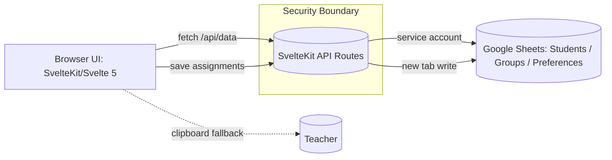

```mermaid
%% Mermaid diagram for high-level architecture
flowchart LR
  UI["Browser UI: SvelteKit/Svelte 5"] -- fetch /api/data --> API[(SvelteKit API Routes)]
  UI -- save assignments --> API
  API -- service account --> GS[(Google Sheets: Students / Groups / Preferences)]
  subgraph Security Boundary
    API
  end
  UI -. clipboard fallback .-> User[(Teacher)]
  API -->|new tab write| GS
```
