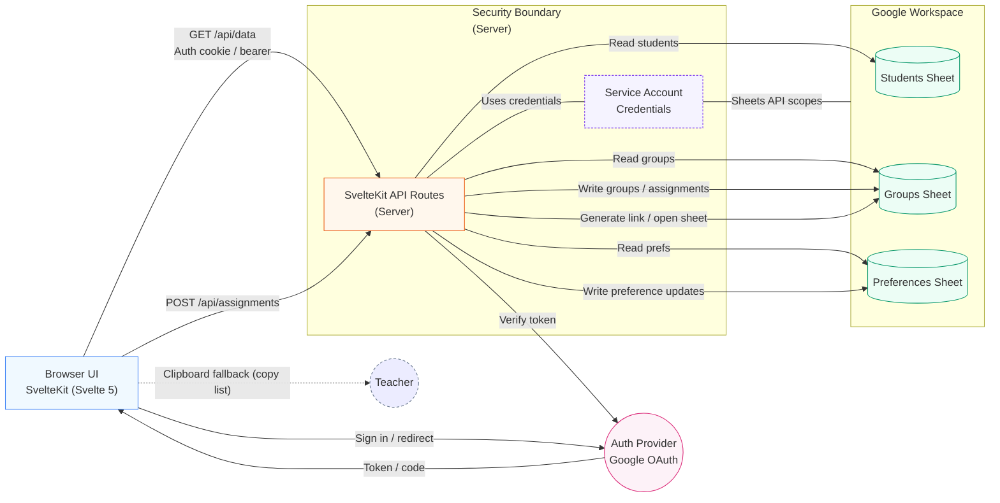
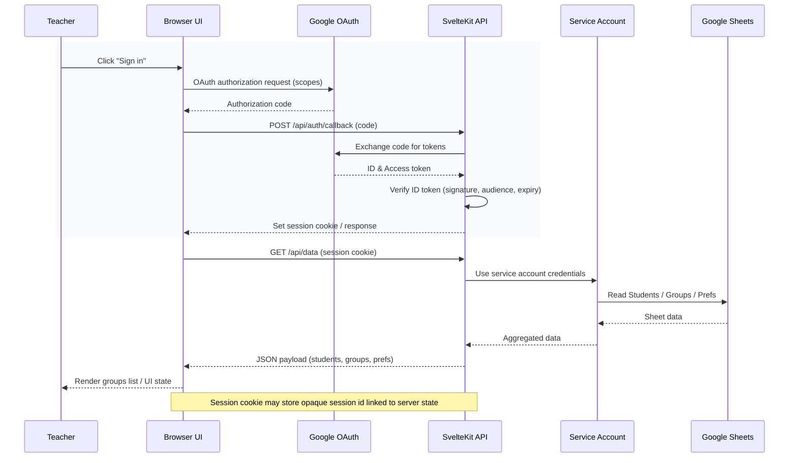
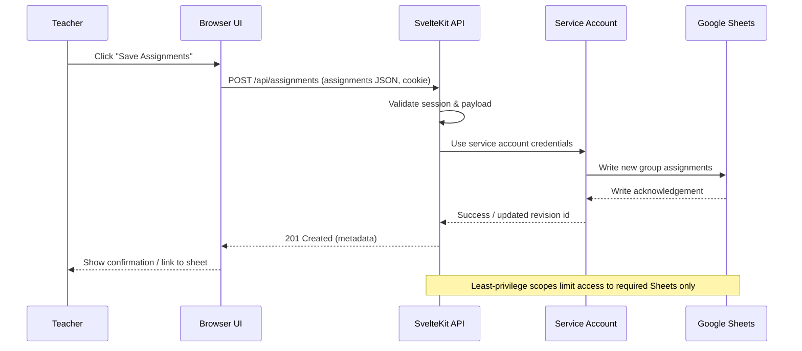

# Architecture Overview

## Legend & Notes
- Security Boundary: API + service account (never exposed client-side).
- Auth Provider: External (Google OAuth). UI receives code/token; API verifies.
- Service Account: Holds Sheets API scopes; only used within server.
- Separate Sheets: Isolation for students, groups, preferences.
- Clipboard Fallback: Manual, no server round trip.
- Generate link: Convenience to open a sheet directly.

---

## Sequence Diagram: Authentication & Initial Data Load

## Sequence Diagram: Create / Save Assignments

### Additional Notes
- Tokens: Only the server (API) exchanges the auth code; browser never gets service account keys.
- Session: Prefer HTTP-only, Secure, SameSite=Lax (or Strict) cookie containing an opaque session id mapped to server-side token data.
- Caching: Consider short-lived in-memory or KV cache for sheet reads to reduce latency; bust cache on writes.
- Error Handling: Distinguish auth (401/403), validation (422), and sheet I/O (5xx with retry guidance).
- Observability: Log correlation id across Browser -> API -> Sheets operations for traceability.