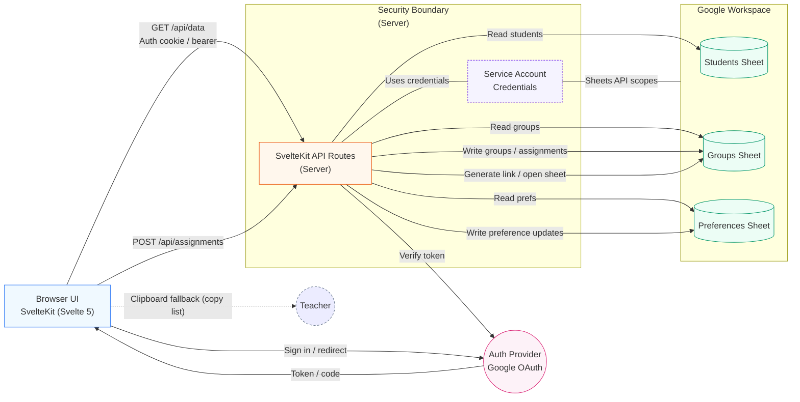

# Architecture Overview

## Legend & Notes
- Security Boundary: API + service account (never exposed client-side).
- Auth Provider: External (Google OAuth). UI receives code/token; API verifies.
- Service Account: Holds Sheets API scopes; only used within server.
- Separate Sheets: Isolation for students, groups, preferences.
- Clipboard Fallback: Manual, no server round trip.
- Generate link: Convenience to open a sheet directly.